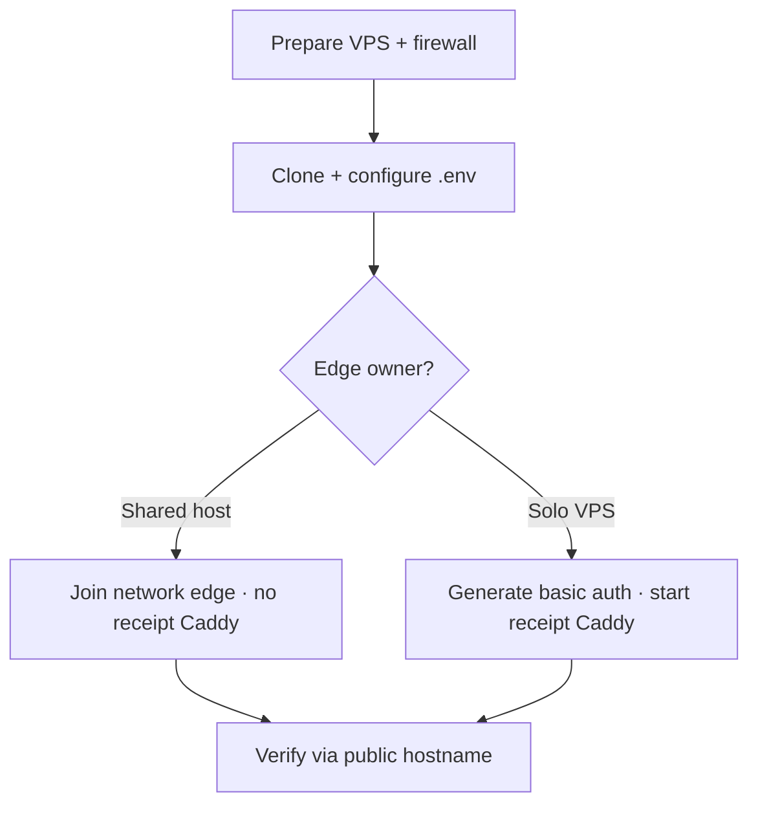

# Deployment Guide

Single-VM path for the Receipt Intelligence demo umbrella: Docker Compose (n8n writer + API reader) with HTTPS at the edge.

Product logic stays in the sibling repos; this guide covers **firewall → `.env` → up → verify**.

## Which path?

| Path | When | Compose files | Who owns 80/443 |
|------|------|---------------|-----------------|
| **[Shared host with AI Doc](#-shared-host-with-ai-doc-caddy)** | Portfolio VPS already runs [ai-doc-to-chat](https://github.com/RoxanaTapia/ai-doc-to-chat-pipeline) Caddy | base + `docker-compose.shared-edge.yml` | **AI Doc Caddy** (do not start this repo’s Caddy) |
| **[Solo VPS (own Caddy)](#-deploy-on-hetzner-solo-caddy)** | Dedicated box for this demo only | base + `docker-compose.caddy.yml` | **This repo’s Caddy** |

Public hostname for the portfolio shared-host path: `https://receipt-intelligence.roxanatapia.dev`



> **Takeaway:** Publish only **22 / 80 / 443**. App ports stay off the public internet. On the AI Doc VPS, **never** run a second Caddy from this repo.

---

## ✅ Prerequisites

| Requirement | Notes |
|-------------|-------|
| **Docker 24+** | Compose v2 plugin (`docker compose`) |
| **git** | Clone this repo + sibling API (build context) |
| **SSH access** | Hetzner (or any) Ubuntu/Debian VPS |
| **Outbound internet** | Image pulls + Let's Encrypt (domain mode) |
| **Domain (optional)** | Needed for ACME TLS; otherwise use [IP-interim](#ip-interim-no-domain-yet) |

Human ops (not automated here): create the VM, point DNS A/AAAA at the VPS when you have a domain.

---

## 💻 VPS sizing

| Profile | Hardware | Use |
|---------|----------|-----|
| **Demo / portfolio** | 4 vCPU / 8 GB RAM (e.g. Hetzner **CPX31** or **CPX32**) | n8n + API + Caddy; comfortable headroom for Anthropic calls |
| **Minimal smoke** | 2 vCPU / 4 GB | Possible for light checks; tight if n8n + builds run together |

Disk: ~20 GB+ free for images and receipt JSON under `data/receipts/`.

---

## 🌐 What ports are public?

| Port | Public? | Role |
|------|---------|------|
| **22** | Yes | SSH |
| **80** | Yes | HTTP → ACME / redirect (Caddy) |
| **443** | Yes | HTTPS (Caddy) |
| **8000** | No (VPS + Caddy) | API — Compose network only |
| **5678** | No (VPS + Caddy) | n8n — Compose network only |

Local smoke **without** Caddy still publishes API/n8n on the host (see [README](README.md)). The Caddy and shared-edge overlays strip those host publishes with `ports: !override []`.

---

## 🔗 Shared host with AI Doc Caddy

Use this on the portfolio VPS where AI Doc already terminates TLS. Receipt containers join Docker network `edge`; AI Doc’s Caddy reverse-proxies the hostname (see [ai-doc #111](https://github.com/RoxanaTapia/ai-doc-to-chat-pipeline/issues/111)).

⚠️ **Do not** run `deploy/docker-compose.caddy.yml` on that host — it will fight AI Doc for ports 80/443.

### 1. Network (once)

```bash
docker network create edge   # ignore error if it already exists
```

### 2. Clone and configure

Same sibling layout as the solo path. In `.env` for **shared host**:

```bash
N8N_BASIC_AUTH_PASSWORD=change-me-strong
ANTHROPIC_API_KEY=          # if you will run workflows / Q&A

COMPOSE_PROJECT_NAME=receipt-intelligence-demo

# Public URL behind AI Doc Caddy — not this repo’s SITE_ADDRESS
N8N_HOST=receipt-intelligence.roxanatapia.dev
N8N_PROTOCOL=https
N8N_PATH=/n8n
WEBHOOK_URL=https://receipt-intelligence.roxanatapia.dev/n8n/
```

Leave `SITE_ADDRESS` / `ACME_EMAIL` / `CADDYFILE` unset. Edge basic auth and TLS live in the **ai-doc** project.

### 3. Start api + n8n on `edge` (no receipt Caddy)

```bash
docker compose --env-file .env -p receipt-intelligence-demo \
  -f deploy/docker-compose.yml -f deploy/docker-compose.shared-edge.yml up --build -d

docker compose --env-file .env -p receipt-intelligence-demo \
  -f deploy/docker-compose.yml -f deploy/docker-compose.shared-edge.yml ps
```

Expect: `api` healthy · `n8n` Up · **no** `caddy` service · host does **not** publish 8000/5678.

Stable aliases on `edge` for the external proxy: `receipt-api:8000` · `receipt-n8n:5678`.

### 4. Verify (after AI Doc site block is live)

End-to-end HTTPS is owned by ai-doc. After their Caddyfile includes this hostname:

```bash
curl -sk -o /dev/null -w "%{http_code}\n" https://receipt-intelligence.roxanatapia.dev/health
# 401 without edge credentials

curl -sk -u demo:YOUR_EDGE_PASSWORD \
  https://receipt-intelligence.roxanatapia.dev/health
# {"status":"ok"}
```

Until the site block lands, confirm backends from another container on `edge`:

```bash
docker run --rm --network edge curlimages/curl:8.5.0 \
  -sS http://receipt-api:8000/health
```

---

## 🚀 Deploy on Hetzner (solo Caddy)

### 1. Prepare the server

```bash
sudo apt-get update && sudo apt-get install -y git ca-certificates curl
# Install Docker 24+ per https://docs.docker.com/engine/install/
sudo usermod -aG docker "$USER"   # log out and back in after this
```

**Firewall** — open only SSH and Caddy:

```bash
sudo ufw allow OpenSSH
sudo ufw allow 80/tcp
sudo ufw allow 443/tcp
sudo ufw enable
sudo ufw status
```

### 2. Clone and configure

Clone **this repo** and the API sibling next to it (Compose build context default):

```text
/opt/receipt-intelligence/   # example layout on the VPS
├── receipt-intelligence-api
└── receipt-intelligence-demo
```

```bash
mkdir -p /opt/receipt-intelligence && cd /opt/receipt-intelligence
git clone https://github.com/RoxanaTapia/receipt-intelligence-api.git
git clone https://github.com/RoxanaTapia/receipt-intelligence-demo.git
cd receipt-intelligence-demo
cp .env.example .env
nano .env
```

Minimum `.env` for **domain mode** (Let's Encrypt):

```bash
N8N_BASIC_AUTH_PASSWORD=change-me-strong
ANTHROPIC_API_KEY=          # if you will run workflows / Q&A

COMPOSE_PROJECT_NAME=receipt-intelligence-demo
SITE_ADDRESS=demo.example.com
ACME_EMAIL=you@example.com

# Public URLs for n8n behind Caddy at /n8n*
N8N_HOST=demo.example.com
N8N_PROTOCOL=https
N8N_PATH=/n8n
WEBHOOK_URL=https://demo.example.com/n8n/
```

DNS: point `SITE_ADDRESS` A/AAAA at this VPS before the first Caddy up (ACME needs to reach :80/:443).

### 3. Generate basic-auth credentials

```bash
chmod +x deploy/generate-caddy-auth.sh deploy/generate-ip-tls.sh
./deploy/generate-caddy-auth.sh demo 'YOUR_STRONG_PASSWORD'
```

Writes `deploy/caddy-basicauth.conf` (gitignored). Re-run to rotate the password. Edge basic auth is separate from n8n’s own `N8N_BASIC_AUTH_*`.

### 4. Start the stack with Caddy

From the **repo root**:

```bash
docker compose --env-file .env -p receipt-intelligence-demo \
  -f deploy/docker-compose.yml -f deploy/docker-compose.caddy.yml up --build -d

docker compose --env-file .env -p receipt-intelligence-demo \
  -f deploy/docker-compose.yml -f deploy/docker-compose.caddy.yml ps
```

Expect: `api` healthy · `n8n` Up · `caddy` Up. Host should **not** publish 8000/5678.

Set `COMPOSE_PROJECT_NAME=receipt-intelligence-demo` in `.env` so you can omit `-p` later. Always pass `--env-file .env` when the first compose file lives under `deploy/`.

### 5. Verify

```bash
# 401 without credentials, 200 with (API health via edge)
curl -sk -o /dev/null -w "%{http_code}\n" https://YOUR_DOMAIN/health
curl -sk -o /dev/null -w "%{http_code}\n" -u demo:YOUR_PASSWORD https://YOUR_DOMAIN/health
```

Open `https://YOUR_DOMAIN/docs` (API) or `https://YOUR_DOMAIN/n8n/` (n8n UI) and complete the browser basic-auth prompt.

Until [issue #3](https://github.com/RoxanaTapia/receipt-intelligence-demo/issues/3), `/` proxies to the API. Demo UX will take the visitor surface later.

---

## 📌 IP-interim (no domain yet)

Use when the VM exists but DNS is not ready. Same public ports; self-signed TLS (browser warning expected).

```bash
# In .env — do not set SITE_ADDRESS for this mode
CADDYFILE=./Caddyfile.ip
# Path is relative to deploy/ when Compose resolves volumes.

./deploy/generate-caddy-auth.sh demo 'YOUR_STRONG_PASSWORD'
./deploy/generate-ip-tls.sh YOUR_VPS_IP

# Optional: point n8n public URL at the IP (still path-prefixed)
N8N_HOST=YOUR_VPS_IP
N8N_PROTOCOL=https
N8N_PATH=/n8n
WEBHOOK_URL=https://YOUR_VPS_IP/n8n/
```

```bash
docker compose --env-file .env -p receipt-intelligence-demo \
  -f deploy/docker-compose.yml -f deploy/docker-compose.caddy.yml up --build -d

curl -sk -o /dev/null -w "%{http_code}\n" -u demo:YOUR_PASSWORD https://YOUR_VPS_IP/health
```

**Cutover IP → domain:** set `SITE_ADDRESS` + `ACME_EMAIL`, remove `CADDYFILE=./Caddyfile.ip`, update `N8N_HOST` / `WEBHOOK_URL`, recreate Caddy (`docker compose … up -d --force-recreate caddy`). Let's Encrypt issues the cert automatically.

---

## 🖥️ Local development (no Caddy)

Unchanged from [README](README.md): base compose only, host ports 8000/5678.

```bash
cp .env.example .env
# set N8N_BASIC_AUTH_PASSWORD

docker compose --env-file .env -f deploy/docker-compose.yml up --build -d
curl -s http://localhost:8000/health
```

To exercise Caddy locally, use IP-interim with `127.0.0.1` (self-signed) and the same two-file compose command.

---

## 🔧 Troubleshooting

| Symptom | Likely cause | Check |
|---------|--------------|-------|
| Connection refused on 443 | Firewall or Caddy down | `ufw status`; `docker compose … ps` |
| Browser TLS warning (domain mode) | DNS not pointing here / ACME failed | A/AAAA → this VM; `docker compose … logs caddy` |
| 502 after login | Backend not ready | From stack: `exec` into a container and `wget -qO- http://api:8000/health` |
| `caddy-basicauth.conf: is a directory` | Bad bind path / project-directory misuse | Run compose from repo root **without** `--project-directory`; regenerate auth file |
| :8000 or :5678 reachable from the internet | Caddy / shared-edge overlay not applied | Confirm the right `-f` overlay and `ports: !override []` |
| `network edge declared as external but could not be found` | Network not created | `docker network create edge` |
| Port 80/443 already allocated | Receipt Caddy started next to AI Doc | Stop receipt Caddy; use [shared-host](#-shared-host-with-ai-doc-caddy) overlay only |

---

## 📚 Related

| Doc | Role |
|-----|------|
| [README.md](README.md) | Local compose smoke |
| [AGENTS.md](AGENTS.md) | Ship order and agent workflow |
| [n8n integration](https://github.com/RoxanaTapia/receipt-intelligence-n8n/blob/main/docs/integration.md) | Workflow import / sample PDFs |
| [ai-doc deploy pattern](https://github.com/RoxanaTapia/ai-doc-to-chat-pipeline/tree/main/deploy) | Shared-host Caddy owner on the portfolio VPS |
| [ai-doc #111](https://github.com/RoxanaTapia/ai-doc-to-chat-pipeline/issues/111) | Site block for `receipt-intelligence.roxanatapia.dev` |
