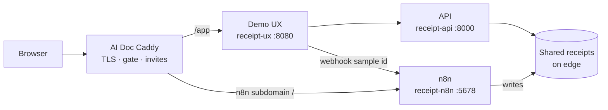

# Receipt Intelligence Demo

Self-serve portfolio demo for **Receipt Intelligence**: n8n categorizes receipts, the API answers spending questions, and a thin visitor UX lets people try the loop without opening the n8n editor.

This umbrella owns **Compose + deploy glue + visitor UX**. Product logic stays in the sibling repos.

| Link | Where |
|------|--------|
| 🚀 **Try the demo** | [receipt-intelligence.roxanatapia.dev](https://receipt-intelligence.roxanatapia.dev/) — public gate → invite or Login → `/app` |
| 📌 **Deploy / VPS** | [DEPLOYMENT.md](DEPLOYMENT.md) — solo Caddy **or** shared host with AI Doc |

| Repo | Role |
|------|------|
| [receipt-intelligence-n8n](https://github.com/RoxanaTapia/receipt-intelligence-n8n) | Ingest + categorization (writes receipt JSON) |
| [receipt-intelligence-api](https://github.com/RoxanaTapia/receipt-intelligence-api) | Analytics + Q&A (reads receipt JSON) |
| **This repo** | Run them together + public demo path |

## Visitor path vs operator path

Same public hostname, two audiences:

| Path | Who | How |
|------|-----|-----|
| **Visitor** | Portfolio guests | Open the [live demo](https://receipt-intelligence.roxanatapia.dev/) → invite or Login → **`/app`**: download the sample PDF → upload it → see live categories → ask a question (seeded examples still available). Invites are for `/app` only. |
| **Operator** | Maintainers | **`n8n.receipt-intelligence.roxanatapia.dev`** — n8n UI at `/` (edge Basic Auth, then n8n **owner** login; keep `N8N_BASIC_AUTH_ACTIVE=false`). Import **and Active/Publish** **Receipt — Ingest PDF** or `/app` live ingest fails with “webhook not registered”. Full VPS steps: [DEPLOYMENT.md](DEPLOYMENT.md). |

You do **not** need the n8n editor to try the visitor demo. The UX calls n8n on the Compose network only (not the browser).

## Architecture (portfolio / shared host)

On the portfolio VPS, **AI Doc Caddy** owns TLS, the invite gate, and reverse proxy. Receipt containers join Docker network `edge`; n8n writes categorized JSON to a shared disk the API reads.



Solo VPS (this repo’s own Caddy) is documented in [DEPLOYMENT.md](DEPLOYMENT.md) — visitor `/app`, n8n often under `/n8n*`; portfolio uses a dedicated n8n host.

## Production / deploy

| Mode | When | Start here |
|------|------|------------|
| **Shared host with AI Doc** | Portfolio VPS already runs AI Doc Caddy | [DEPLOYMENT.md — Shared host](DEPLOYMENT.md#-shared-host-with-ai-doc-caddy) |
| **Solo Caddy** | Dedicated box for this demo only | [DEPLOYMENT.md — Solo Hetzner](DEPLOYMENT.md#-deploy-on-hetzner-solo-caddy) |

Product workflow import and sample PDFs: [n8n integration runbook](https://github.com/RoxanaTapia/receipt-intelligence-n8n/blob/main/docs/integration.md).

## Local compose smoke

Prerequisites: Docker (Compose v2), and the API sibling cloned next to this repo:

```text
<parent>/
├── receipt-intelligence-api
└── receipt-intelligence-demo   # this repo
```

```bash
cp .env.example .env
# set N8N_BASIC_AUTH_PASSWORD (and ANTHROPIC_API_KEY for Q&A / workflows)

./deploy/seed-demo-data.sh

docker compose --env-file .env -f deploy/docker-compose.yml up --build -d

curl -s http://localhost:8000/health
# {"status":"ok"}

curl -s http://localhost:8080/health
# {"status":"ok"}

# One question against seeded receipts (needs ANTHROPIC_API_KEY)
curl -s http://localhost:8000/questions \
  -H 'Content-Type: application/json' \
  -d '{"question":"How much did I spend on drinks in July 2026?"}'

# Optional: confirm n8n can reach the API on the Compose network
docker compose --env-file .env -f deploy/docker-compose.yml exec n8n \
  wget -qO- http://api:8000/health
```

| Service | Host URL |
|---------|----------|
| **Demo UX** | http://localhost:8080/ |
| API | http://localhost:8000/docs |
| n8n | http://localhost:5678 |

If host port `5678` or `8080` is already in use, set `N8N_HOST_PORT` / `UX_PORT` in `.env` before `up`.

Shared categorized JSON lives in `data/receipts/` (seed script + n8n writes; API reads via `RECEIPT_DATA_PATH=/data/receipts`). On the Compose network, the UX uses `http://api:8000` and triggers live ingest at `N8N_INGEST_WEBHOOK_URL` (default `http://n8n:5678/webhook/receipt-demo-ingest`). Demo sample PDFs are vendored under `demo/samples/` and mounted into n8n at `/home/node/.n8n-files/samples`.

Live PDF path needs the ingest workflow **Active** in n8n (see [n8n demo webhook](https://github.com/RoxanaTapia/receipt-intelligence-n8n/blob/main/docs/n8n-setup.md#demo-sample-webhook)).

## Agent workflow

Start with [`AGENTS.md`](AGENTS.md). Slash commands: `/lecture-on-issue`, `/ship-issue`, `/document`, `/verify`, `/ship-complete`.
