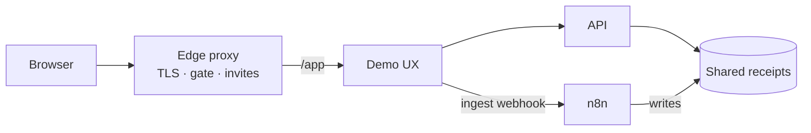

# Receipt Intelligence Demo

Self-serve portfolio pilot for **Smart Receipt Insights**: upload a receipt PDF, get categories automatically, and ask spend questions in plain English — **Receipt → n8n → Answers** — without opening the n8n editor.

This repo is the **delivery umbrella**: Docker Compose, HTTPS deploy glue, and the thin visitor UX. Categorization and Q&A product logic live in companion modules (not required to try the live demo).

🚀 **Try the demo:** [receipt-intelligence.roxanatapia.dev](https://receipt-intelligence.roxanatapia.dev/) — public gate → invite or Login → `/app`

## What visitors see

1. Open the [live demo](https://receipt-intelligence.roxanatapia.dev/)
2. Sign in (invite or Login) and go to **`/app`**
3. Download the sample PDF → upload it → see live categories → ask a question

Seeded examples stay available if you skip the live upload. Invites unlock `/app` only — you never need the n8n UI as a guest.

## Architecture

On the portfolio VPS, an edge reverse proxy owns TLS and the invite gate. Receipt services join a shared Docker network: n8n writes categorized JSON to a shared volume; the API reads it for analytics and Q&A; the demo UX calls both on the private network (the browser never talks to n8n).



| Piece | Role |
|-------|------|
| **Demo UX** (this repo, `demo/`) | Visitor UI — sample download, upload, categories, questions |
| **n8n** | Ingest + categorization (writes receipt JSON) |
| **API** | Analytics + natural-language Q&A (reads receipt JSON) |
| **Compose / Caddy** (this repo, `deploy/`) | Run them together on one VPS |

Companion n8n and API source repos are private for now; this public repo shows how the pilot is wired and deployed. Operator deploy steps (including workflow import) live in [DEPLOYMENT.md](DEPLOYMENT.md).

## Local compose smoke

Prerequisites: Docker (Compose v2). The API image builds from a companion API checkout next to this repo (default path below). That companion is private — use the [live demo](https://receipt-intelligence.roxanatapia.dev/) if you only want to try the product.

```text
<parent>/
├── receipt-intelligence-api   # companion (private)
└── receipt-intelligence-demo  # this repo
```

```bash
cp .env.example .env
# set N8N_BASIC_AUTH_PASSWORD (and ANTHROPIC_API_KEY for Q&A / workflows)

./deploy/seed-demo-data.sh

docker compose --env-file .env -f deploy/docker-compose.yml up --build -d

curl -s http://localhost:8000/health
# {"status":"ok"}

curl -s http://localhost:8080/health
# {"status":"ok"}

# One question against seeded receipts (needs ANTHROPIC_API_KEY)
curl -s http://localhost:8000/questions \
  -H 'Content-Type: application/json' \
  -d '{"question":"How much did I spend on drinks in July 2026?"}'
```

| Service | Host URL |
|---------|----------|
| **Demo UX** | http://localhost:8080/ |
| API | http://localhost:8000/docs |
| n8n | http://localhost:5678 |

If host port `5678` or `8080` is already in use, set `N8N_HOST_PORT` / `UX_PORT` in `.env` before `up`.

Shared categorized JSON lives in `data/receipts/` (seed script + n8n writes; API reads via `RECEIPT_DATA_PATH=/data/receipts`). On the Compose network, the UX uses `http://api:8000` and triggers live ingest at `N8N_INGEST_WEBHOOK_URL` (default `http://n8n:5678/webhook/receipt-demo-ingest`). Demo sample PDFs are under `demo/samples/`.

Live PDF ingest needs the ingest workflow **Active** in n8n — see [DEPLOYMENT.md — Live sample PDF](DEPLOYMENT.md#live-sample-pdf-operators).

## Maintainers

Ship workflow, agent roster, and issue map: [`AGENTS.md`](AGENTS.md).
