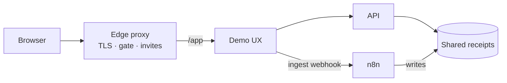

# Receipt Intelligence Demo

Self-serve portfolio pilot for **Smart Receipt Insights**: upload a receipt PDF, get categories automatically, and ask spend questions in plain English — **Receipt → n8n → Answers** — without opening the n8n editor.

This repo is the **delivery umbrella**: Docker Compose, HTTPS deploy glue, and the thin visitor UX. Categorization and Q&A product logic live in companion modules (not required to try the live demo).

🚀 **Try the demo:** [receipt-intelligence.roxanatapia.dev](https://receipt-intelligence.roxanatapia.dev/) — request an invite, receive a code, redeem it

## What visitors see

1. Open the [live demo](https://receipt-intelligence.roxanatapia.dev/)
2. Request an invite → receive a code → redeem it
3. Download the sample PDF → upload it → see live categories → ask a question

Seeded examples stay available if you skip the live upload. An invite unlocks the demo only — you never need the n8n UI as a guest.

## Architecture

On the portfolio VPS, an edge reverse proxy owns TLS and the invite gate. Receipt services join a shared Docker network: n8n writes categorized JSON to a shared volume; the API reads it for analytics and Q&A; the demo UX calls both on the private network (the browser never talks to n8n).

| Piece | Role |
|-------|------|
| **Demo UX** (this repo, `demo/`) | Visitor UI — sample download, upload, categories, questions |
| **n8n** | Ingest + categorization (writes receipt JSON) |
| **API** | Analytics + natural-language Q&A (reads receipt JSON) |
| **Compose / Caddy** (this repo, `deploy/`) | Run them together on one VPS |

Companion n8n and API source repos are private for now; this public repo shows how the pilot is wired and deployed. Operator deploy and local compose steps live in [DEPLOYMENT.md](DEPLOYMENT.md).

## Try it / full stack

- **Try the product** in the [live demo](https://receipt-intelligence.roxanatapia.dev/) (request an invite, receive a code, redeem it).
- **This repo** is the visitor UX plus Compose/deploy glue — enough to see how the pilot is packaged.
- **Full local stack** (API + n8n workflows, run on your machine): available on request — [contact me](https://roxanatapia.dev/contact/).

## Maintainers

Ship workflow, agent roster, and issue map: [`AGENTS.md`](AGENTS.md).
