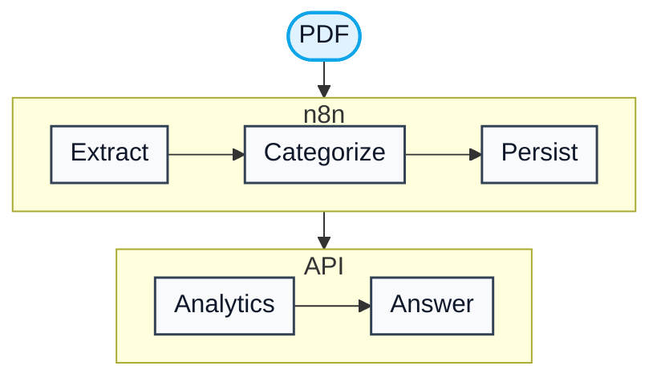

# Receipt Intelligence

> Upload a receipt PDF, get line-item categories, and ask spend questions in plain language.

A visitor tries the loop without opening n8n: download a sample receipt, watch it get categorized, then ask what was spent. Categories land as JSON on disk. Questions are answered from those numbers.

> **Takeaway:** This is a receipt-to-answers pipeline, not a chatbot that guesses a budget. If the receipts do not contain the spend, it says so.

---

## Try the demo

🟢 **Live** · <a href="https://receipt-intelligence.roxanatapia.dev/" target="_blank" rel="noopener noreferrer"><strong>receipt-intelligence.roxanatapia.dev</strong></a>

- Request an invite on the gate, then redeem the code
- Start with the sample PDF on the demo page — download it, upload that same file, and watch categories appear
- Seeded examples stay available if you skip the live upload
- Optional: [ask for a walkthrough on Upwork](https://www.upwork.com/freelancers/roxanadev) or [contact me](https://roxanatapia.dev/contact/)

The public pilot is a shared demo with fictional merchants and demo currency (DC). Use only the sample PDF.

---

## How a receipt becomes an answer

Each step exists to keep the answer inside receipts that were actually ingested.

| Step | Technique | Why? |
|------|-----------|------|
| **Read** | n8n extracts text from the PDF | Receipts are layouts, not spreadsheets. |
| **Extract** | Claude fills a receipt schema (merchant, date, line items) | Downstream steps need structured fields, not prose. |
| **Categorize** | Each line gets a category from a fixed taxonomy | "Drinks" can total across merchants. |
| **Validate** | Schema and taxonomy checks, with a short retry | Invalid JSON never becomes the answer. |
| **Persist** | Canonical JSON on a shared volume | One store: n8n writes, the API reads. |
| **Analytics** | FastAPI aggregates by date and category | Totals stay deterministic. The model does not do the math. |
| **Answer** | Claude routes the question, then narrates those totals | The model explains numbers it was given. |

The visitor UI lives in [`demo/`](demo/). Deploy glue lives in [`deploy/`](deploy/). Map: [docs/README.md](docs/README.md). Deploy picture: [docs/product/architecture.md](docs/product/architecture.md).

---

## What it does well

| Feature | In practice |
|---------|-------------|
| **Live ingest** | Download the sample, upload it, see categories on the same page |
| **Line-item categories** | Taxonomy on every line, not a single merchant guess |
| **Spending context** | Totals by category in a date window you can change |
| **Plain-language Q&A** | Ask how much went to drinks, not how to read a JSON file |
| **Self-serve** | No n8n editor. The browser never talks to n8n. |

## Known limits

| Limit | In practice |
|-------|-------------|
| **Shared demo** | Fictional merchants, demo currency (DC). Not your private archive. |
| **Allowlisted sample** | Live ingest on the public pilot accepts the demo PDF, not arbitrary uploads |
| **One corpus** | Questions cover the seeded examples plus what you ingested in this session |
| **Not bookkeeping** | No tax export, bank sync, or multi-user accounts |

---

## Stack

n8n · FastAPI · Claude · Docker Compose · Caddy

The visitor UX and Compose packaging are in this repo. Companion n8n workflows and API source are private; a full-stack walkthrough is available on request — [contact me](https://roxanatapia.dev/contact/). Operator deploy: [DEPLOYMENT.md](DEPLOYMENT.md).

[Roxana Tapia](https://github.com/RoxanaTapia) · [Upwork](https://www.upwork.com/freelancers/roxanadev)
