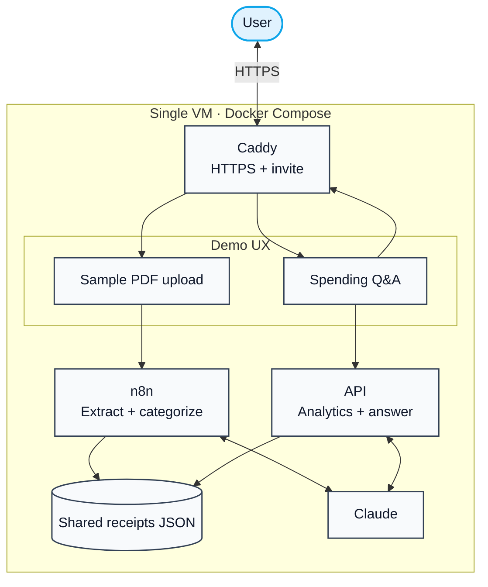
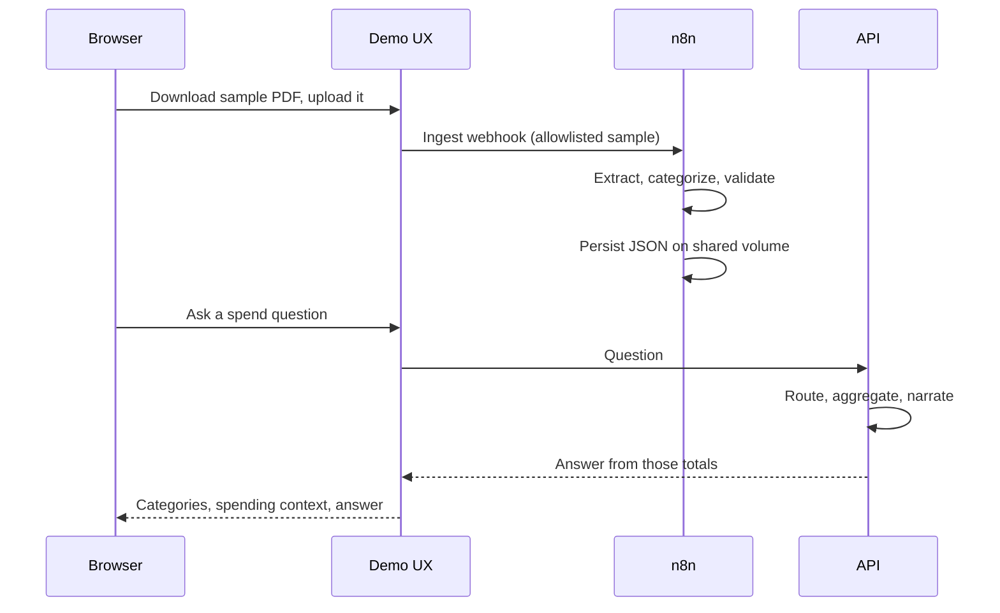

# Architecture

## Background

How the live demo runs on one machine. For the product pipeline and module map, see [docs/README.md](../README.md). For install steps, see [DEPLOYMENT.md](../../DEPLOYMENT.md).

> **Takeaway:** HTTPS at the edge. The browser never talks to n8n. n8n writes categorized JSON; the API reads that same folder.

---

## What runs where

n8n writes. The API reads. Claude extracts, categorizes, and narrates — it does not do the spend math.

| Piece | Role |
|-------|------|
| **Caddy** | HTTPS and the invite gate. Only ports 80 and 443 face the internet. On the portfolio VPS this process runs in [roxanatapia-edge](https://github.com/RoxanaTapia/roxanatapia-edge). |
| **Demo UX** | Sample download, live ingest, spending context, questions. This repo, [`demo/`](../../demo/). |
| **n8n** | Extract, categorize, validate, persist JSON. The browser never talks to it. |
| **API** | Deterministic totals, then a narrated answer from those numbers. |
| **Shared volume** | One store: n8n writes, the API reads. |
| **Claude** | Schema fill and categories in n8n; question routing and narration in the API. |

---

## One question

---

## What this pilot does not include yet

A private archive, tax export, bank sync, or multi-user accounts. Those wait for a real engagement. The extract → persist → aggregate loop stays the same when they land.
